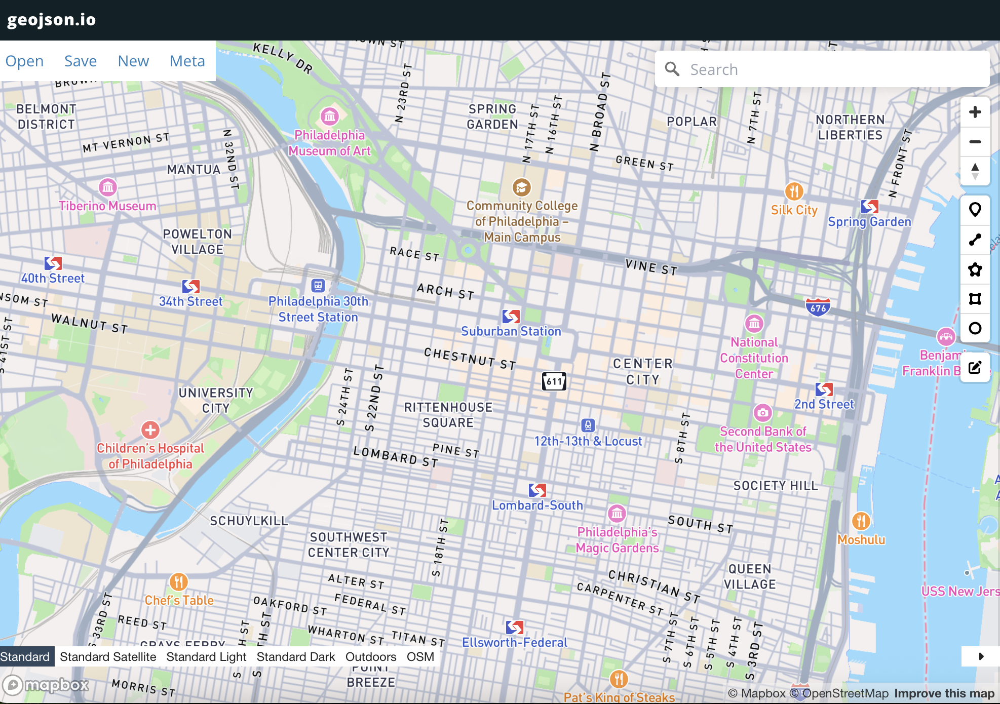
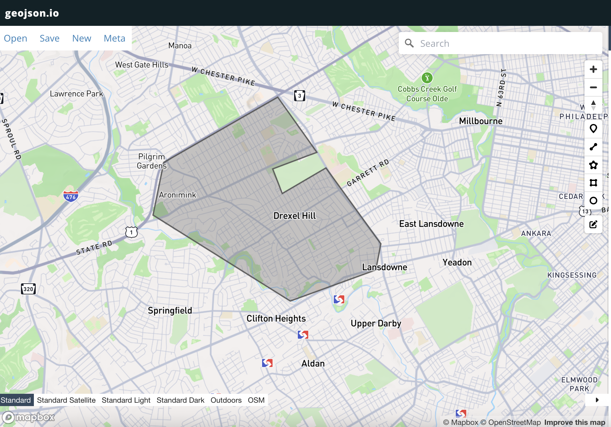
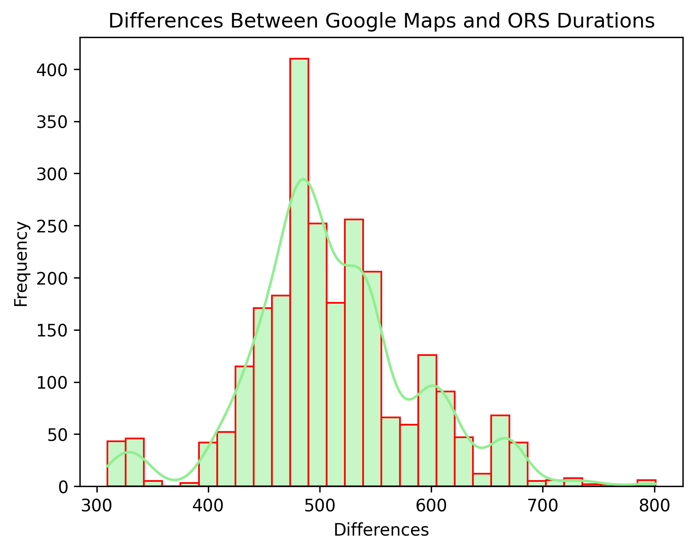
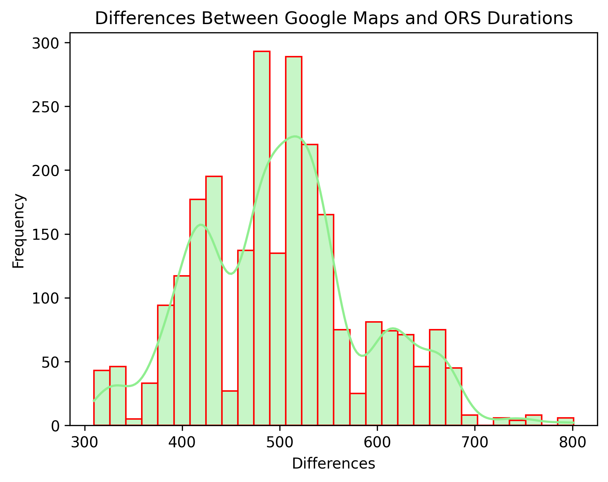
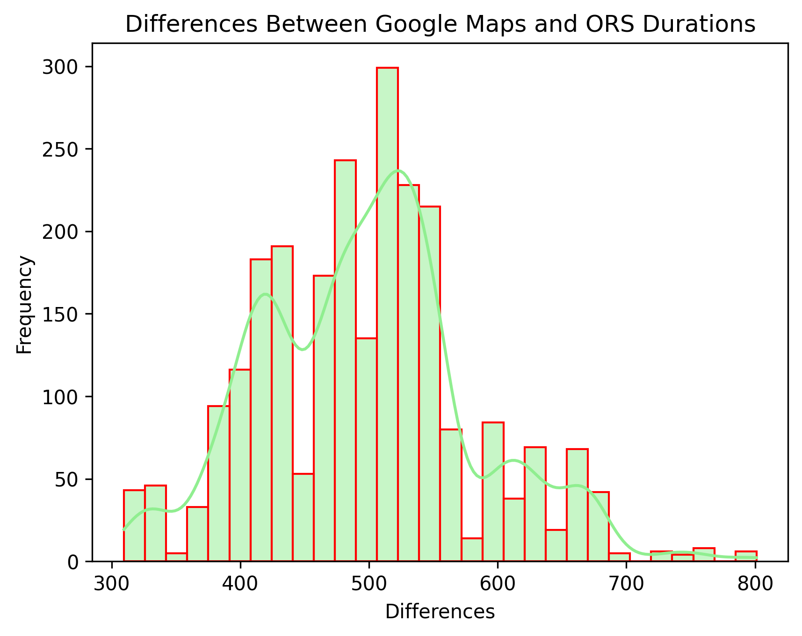

## Duration Comparisons Using Open Route Service and Google Maps API  
**Author:** Adelle Melnikov  

---

### Includes:

#### `src/`  
- `ors_construct.py`  
- `ors_convert.py`  
- `maps_construct.py`  

#### `data/`  
**CSV files**:  
- `inputs`: sources and targets with `"Longitude, Latitude"` coordinates  
- `matrices`: duration matrices of specified sources and targets from OpenRouteService and Google Maps API 
- `directions`: path of intervals seperated by waycategory (1 = highway, 0 = residential) for each source and target pair 

**JSON files**:  
- Polygon coordinates for enclosed areas in:
  - Drexel Hill  
  - Mount Airy & Germantown  
  - Northeast Philadelphia  
  - Center City Philadelphia  
  *(drawn using [geojson.io](https://geojson.io/#map=2/0/20))*

- Coordinates of nodes representing:
  - Residential areas not in the city  
  - Places of work in the city  
  *(queried from [Overpass Turbo](https://overpass-turbo.eu/))*

#### `ors-docker/`  
Materials for the Docker container used to run OpenRouteService and draw graphs  
[OpenRouteService GitHub](https://github.com/GIScience/openrouteservice)

---

## Goal:  
**Determine and Improve Inaccuracies in Open Street Map.**  
* We do this by comparing the open-source durations to Google Maps durations, which account for **time of day**.

---

## Steps:

1. Use [geojson.io](https://geojson.io/#map=2/0/20) to draw desired polygon areas. 
 
   
   

    In total, four polygons are drawn oustside Center City Philadelphia: Northeast area, Mount Airy and Germantown, and Drexel Hill suburbs. The fifth polygon is drawn directly in Center City, Philadelphia. Their coordinates are in data/json/polygon.json 

2. Pass the polygon coordinates into [Overpass Turbo](https://overpass-turbo.eu/) to query nodes mapped on OpenRouteService. 
 
3. Run `ors_convert.py` to get CSV files formatted as `"Longitude, Latitude"`—these are node coordinates output by Overpass Turbo that serve as sources and targets. All source and target node coordinates are located in data/csv/inputs.
 
4. Run `ors_construct.py` (within a virtual environment) through a Docker container to generate output matrix files of duration times between specified sources and targets. 
   Run `maps_construct.py` to get **duration matrices** for the same sources and targets using Google Maps.  
 
5. Run `compare.py` to generate **histograms** of the differences:  
   `google_maps_durations - ors_durations`  
   *(all values are in seconds)*  
   
   
   

<h4>6. Run <code>ors_cluster.py</code> to get highway segments that act as centroids of all highway segments in the paths inbound to Center City Philadelphia.</h4>

  
  
  
  
  
  
  
  

Directions for the paths and a corresponding matrix containing which paths have a highway will also be output to files. The following descriptions can be found in `data/csv/matrices`  
- differeces: a matrix for area of sources, where each cell is the difference in seconds between the google maps api duration time and openrouteservice duration time 
- geometry: coordinates of points making up each shortest path, and their waycategory 
- waycategory: a matrix for each area of sources, where each cell is marked 1 is a highway is present somewhere in the path between the source and target and 0 if no highway is present

## Results:

The differences between google maps duration times and openrouteservice duration times have a negative difference for Mount Airy and Germantown suburbs, inbound to Center City Philadelphia

  
